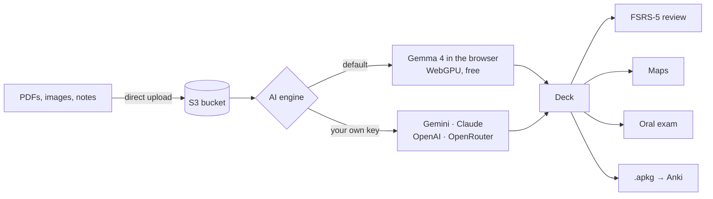

<div align="center">


**Upload your lecture slides, get a study-ready deck.**<br/>
Built by medical students, for medical students.

[](https://ankix.vercel.app)

[](https://github.com/DuPont9029/ankix/stargazers)
[](https://github.com/DuPont9029/ankix/network/members)
[](https://github.com/DuPont9029/ankix/issues)
[](https://github.com/DuPont9029/ankix/pulls)
[](https://github.com/DuPont9029/ankix/commits/main)
[](https://github.com/DuPont9029/ankix/search?l=typescript)
[](https://github.com/DuPont9029/ankix)

</div>

https://github.com/user-attachments/assets/c0ae299a-8ac0-4977-b14e-4457c32be436

---

## Overview

Ankix turns PDFs, photos of anatomical plates and lecture notes into Anki flashcards.
By default the model runs **entirely in your browser** (Gemma 4 on WebGPU): no API keys, no cost, and your files never leave your device.
If you prefer a larger model, you can bring your own Gemini, Claude, OpenAI or OpenRouter key.

Ankix is also a place to study: spaced repetition with the same algorithm as Anki, a daily study plan, concept maps and a simulated oral exam graded on the Italian 30-point scale.

<table>
<tr>
<td width="50%" valign="top">

### Generate
- Question/answer and cloze cards
- **Image occlusion** for anatomical plates and histology slides
- Mind maps and concept maps (Novak)
- Export to Anki (`.apkg`) or CSV

</td>
<td width="50%" valign="top">

### Study
- **FSRS-5** spaced repetition
- A daily plan that adapts to your pace
- Calendar with an exam date per deck
- Insights into weak decks and frequently forgotten cards

</td>
</tr>
<tr>
<td width="50%" valign="top">

### Oral exam
- A virtual examiner asks spoken questions about your materials
- Answer out loud; your response is transcribed and assessed
- Grade out of 30, with mistakes and topics to review
- Works fully offline (Whisper in the browser)

</td>
<td width="50%" valign="top">

### Class
- Sign in with Google or GitHub, gated by a class TOTP code
- Shared or private materials, at the uploader's choice
- Decks are private by default and can be published at any time
- Save a copy of classmates' public decks

</td>
</tr>
</table>

## How it works



There is no conventional database. All data lives in the S3 bucket as **Parquet** tables queried with **DuckDB**, coordinated by a distributed lock (Redis, or an S3 lease) so that multiple Vercel instances can write concurrently without conflicts.

## Tech stack

<p align="center">
  <a href="https://skillicons.dev">
    
  </a>
</p>

<p align="center">
  
  
  
  
  
</p>

## Getting started

```bash
bun install
cp .env.example .env.local   # fill in the values
bun dev                      # → http://localhost:3000
```

You need an S3-compatible bucket (MinIO, R2, Wasabi, Cubbit, …) and a Google OAuth client. Everything else is optional.

<details>
<summary><b>Environment variables</b></summary>
<br/>

**Required**

| Variable | Purpose |
|---|---|
| `BETTER_AUTH_SECRET` | At least 32 characters (`openssl rand -base64 32`). Changing it signs everyone out |
| `GOOGLE_CLIENT_ID` / `GOOGLE_CLIENT_SECRET` | Google sign-in |
| `AWS_S3_ENDPOINT`, `AWS_REGION` | Bucket endpoint and region |
| `AWS_ACCESS_KEY_ID` / `AWS_SECRET_ACCESS_KEY` | Bucket credentials |
| `S3_BUCKET` / `S3_PREFIX` | Bucket name and key prefix |
| `AWS_S3_FORCE_PATH_STYLE` | `true` for most S3-compatible providers |

**Optional**

| Variable | Purpose |
|---|---|
| `GITHUB_CLIENT_ID` / `GITHUB_CLIENT_SECRET` | GitHub sign-in |
| `ALLOWED_EMAIL_DOMAINS` | e.g. `studenti.unimi.it,unimi.it` |
| `CLASS_TOTP_SECRET` | 6-digit code required on first sign-in |
| `ADMIN_EMAILS` | Users allowed to view the class code QR |
| `NEXT_PUBLIC_CLASS_NAME` | Course name shown in the UI |
| `GEMINI_MODEL`, `ANTHROPIC_MODEL`, `OPENAI_MODEL`, `OPENROUTER_MODEL` | Default models |
| `UPSTASH_REDIS_REST_URL` / `_TOKEN` | Fast Redis-backed lock (recommended on Vercel) |
| `MAX_UPLOAD_MB` | Defaults to 50 |

`BETTER_AUTH_URL` is already set in `.env.development` / `.env.production`; do not add it to `.env.local`.

</details>

<details>
<summary><b>Google sign-in</b></summary>
<br/>

1. In [Google Cloud Console → Credentials](https://console.cloud.google.com/apis/credentials), create an **OAuth client ID** (*Web application*).
2. Authorized JavaScript origins: `http://localhost:3000` and your production domain.
3. Authorized redirect URI: `<BETTER_AUTH_URL>/api/auth/callback/google`.
4. Copy the client ID and secret into `.env.local`.

GitHub works the same way (*Settings → Developer settings → OAuth Apps*, callback `/api/auth/callback/github`).

</details>

<details>
<summary><b>Bucket CORS</b></summary>
<br/>

Files are uploaded from the browser straight to the bucket via presigned URLs, so the bucket must accept `PUT` requests from your site. If it doesn't, Ankix automatically falls back to proxying uploads through the server; this still works, but is slower for large files.

```json
[{
  "AllowedOrigins": ["https://ankix.example.com", "http://localhost:3000"],
  "AllowedMethods": ["PUT", "GET", "HEAD"],
  "AllowedHeaders": ["*"],
  "ExposeHeaders": ["ETag"],
  "MaxAgeSeconds": 3600
}]
```

</details>

<details>
<summary><b>Deploying to Vercel</b></summary>
<br/>

1. Import the repository (Next.js and Bun are detected automatically).
2. Copy the environment variables and set `BETTER_AUTH_URL` to your production domain.
3. Add **Upstash Redis** from the Marketplace (free tier). Without it, every write takes an extra 1–2 seconds.
4. Keep Fluid compute enabled so background generation can run for up to 300 s.

The DuckDB-WASM Parquet extension is vendored in `vendor/duckdb-extensions/`. When upgrading `@duckdb/duckdb-wasm`, download the matching extension version as well.

</details>

<details>
<summary><b>Project structure</b></summary>
<br/>

```
src/
├─ app/(app)/        pages: today, plan, materials, decks, study, maps, exam
├─ app/api/          API routes
└─ lib/
   ├─ db.ts          DuckDB + versioned Parquet on the bucket
   ├─ lock.ts        distributed lock (Redis or S3)
   ├─ srs.ts         FSRS-5
   ├─ study.ts       daily plan and calendar
   ├─ anki.ts        .apkg / CSV export
   └─ ai/            cloud providers and local model
```

</details>

## Community

<div align="center">

<a href="https://github.com/DuPont9029/ankix/graphs/contributors">
  
</a>

<br/><br/>

<a href="https://star-history.com/#DuPont9029/ankix&Date">
  <picture>
    <source media="(prefers-color-scheme: dark)" srcset="https://api.star-history.com/svg?repos=DuPont9029/ankix&type=Date&theme=dark" />
    
  </picture>
</a>

<!-- Repobeats: generate the embed link at https://repobeats.axiom.co and paste it below

-->

</div>

---

<div align="center">
<sub>If Ankix helped you through exam season, consider starring the repo</sub>
</div>


