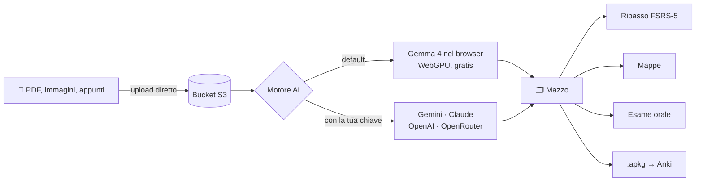

<div align="center">


**Carichi le slide, ti ritrovi il mazzo pronto da studiare.**<br/>
Fatto da studenti di Medicina, per studenti di Medicina.

[ ](https://ankix.vercel.app)
[ ](https://github.com/user-attachments/assets/c0ae299a-8ac0-4977-b14e-4457c32be436)

[ ](https://github.com/DuPont9029/ankix/stargazers)
[ ](https://github.com/DuPont9029/ankix/network/members)
[ ](https://github.com/DuPont9029/ankix/issues)
[ ](https://github.com/DuPont9029/ankix/pulls)
[ ](https://github.com/DuPont9029/ankix/commits/main)
[ ](https://github.com/DuPont9029/ankix/search?l=typescript)
[ ](https://github.com/DuPont9029/ankix)

</div>

https://github.com/user-attachments/assets/c0ae299a-8ac0-4977-b14e-4457c32be436


---

## Cos'è

Ankix prende PDF, foto delle tavole e appunti e li trasforma in flashcard per Anki.
L'AI gira **direttamente nel tuo browser** (Gemma 4 su WebGPU): niente chiavi, niente costi, i tuoi file non finiscono da nessuna parte.
Se preferisci un modello più grosso puoi usare la tua chiave Gemini, Claude, OpenAI o OpenRouter.

Poi ci studi sopra: ripasso con lo stesso algoritmo di Anki, piano giornaliero, mappe concettuali e pure una simulazione d'esame orale con voto in trentesimi.

<table>
<tr>
<td width="50%" valign="top">

###  Genera

* Card domanda/risposta e cloze
* **Image occlusion** su tavole anatomiche e vetrini
* Mappe mentali e mappe concettuali (Novak)
* Export `.apkg` per Anki o CSV

</td>
<td width="50%" valign="top">

### Studia

* Ripetizione dilazionata **FSRS-5**
* Percorso del giorno che si adatta al tuo ritmo
* Calendario con data d'esame per ogni mazzo
* Statistiche su mazzi deboli e card dimenticate

</td>
</tr>
<tr>
<td width="50%" valign="top">

###  Esame orale

* Il "prof" ti fa domande a voce sui materiali
* Rispondi parlando, lui trascrive e valuta
* Voto in trentesimi, errori e argomenti da ripassare
* Funziona anche tutto offline (Whisper nel browser)

</td>
<td width="50%" valign="top">

###  Classe

* Login Google o GitHub, codice TOTP della classe
* Materiali condivisi o privati, a scelta
* Mazzi privati di default, pubblicabili quando vuoi
* Salvi una copia dei mazzi degli altri

</td>
</tr>
</table>

## Come funziona



Non c'è un database vero e proprio: tutto vive sul bucket S3 come tabelle **Parquet** lette con **DuckDB**, con un lock distribuito (Redis o lease su S3) così più istanze Vercel possono scrivere senza pestarsi i piedi.

## Stack

<p align="center">
<a href="https://skillicons.dev">

</a>
</p>

<p align="center">


</p>

## Avvio rapido

```bash
bun install
cp .env.example .env.local   # compila i valori
bun dev                      # → http://localhost:3000
```

Ti servono un bucket S3-compatibile (MinIO, R2, Wasabi, Cubbit…) e un client OAuth Google. Il resto è opzionale.

<details> <summary><b> Variabili d'ambiente</b></summary> <br/>

**Obbligatorie**

| Variabile | A cosa serve |
|----|----|
| `BETTER_AUTH_SECRET` | ≥ 32 caratteri (`openssl rand -base64 32`). Se lo cambi tutti devono rifare login |
| `GOOGLE_CLIENT_ID` / `GOOGLE_CLIENT_SECRET` | Login con Google |
| `AWS_S3_ENDPOINT`, `AWS_REGION` | Endpoint e regione del bucket |
| `AWS_ACCESS_KEY_ID` / `AWS_SECRET_ACCESS_KEY` | Credenziali del bucket |
| `S3_BUCKET` / `S3_PREFIX` | Bucket e prefisso |
| `AWS_S3_FORCE_PATH_STYLE` | `true` per quasi tutti gli S3-compatibili |

**Opzionali**

| Variabile | A cosa serve |
|----|----|
| `GITHUB_CLIENT_ID` / `GITHUB_CLIENT_SECRET` | Login con GitHub |
| `ALLOWED_EMAIL_DOMAINS` | Es. `studenti.unimi.it,unimi.it` |
| `CLASS_TOTP_SECRET` | Codice a 6 cifre richiesto al primo accesso |
| `ADMIN_EMAILS` | Chi può vedere il QR del codice di classe |
| `NEXT_PUBLIC_CLASS_NAME` | Nome del corso nell'interfaccia |
| `GEMINI_MODEL`, `ANTHROPIC_MODEL`, `OPENAI_MODEL`, `OPENROUTER_MODEL` | Modelli predefiniti |
| `UPSTASH_REDIS_REST_URL` / `_TOKEN` | Lock veloce su Redis (consigliato su Vercel) |
| `MAX_UPLOAD_MB` | Default 50 |

`BETTER_AUTH_URL` è già in `.env.development` / `.env.production`: non metterlo in `.env.local`.

</details>

<details> <summary><b> Login con Google</b></summary> <br/>


1. [Google Cloud Console → Credenziali](https://console.cloud.google.com/apis/credentials) → crea un **ID client OAuth** (*Applicazione web*).
2. Origini autorizzate: `http://localhost:3000` e il tuo dominio.
3. Redirect: `<BETTER_AUTH_URL>/api/auth/callback/google`.
4. Copia ID e segreto nel `.env.local`.

GitHub è uguale (*Settings → Developer settings → OAuth Apps*, callback `/api/auth/callback/github`).

</details>

<details> <summary><b> CORS del bucket</b></summary> <br/>

I file vanno dal browser al bucket con URL prefirmati, quindi il bucket deve accettare `PUT` dal sito. Se non lo fa, Ankix passa dal server da solo: funziona lo stesso, solo più lento sui file grossi.

```json
[{
  "AllowedOrigins": ["https://ankix.miodominio.it", "http://localhost:3000"],
  "AllowedMethods": ["PUT", "GET", "HEAD"],
  "AllowedHeaders": ["*"],
  "ExposeHeaders": ["ETag"],
  "MaxAgeSeconds": 3600
}]
```

</details>

<details>
<summary><b>▲ Deploy su Vercel</b></summary>
<br/>


1. Importa il repo (Next.js e Bun vengono rilevati da soli).
2. Copia le variabili d'ambiente e imposta `BETTER_AUTH_URL` al dominio di produzione.
3. Aggiungi **Upstash Redis** dal Marketplace (piano gratuito): senza, ogni scrittura prende 1–2 secondi in più.
4. Lascia attivo Fluid compute: la generazione in background arriva a 300 s.

L'estensione parquet di DuckDB-WASM è già in `vendor/duckdb-extensions/`. Se aggiorni `@duckdb/duckdb-wasm` ricordati di scaricare quella nuova.

</details>

<details>
<summary><b>📁 Struttura del codice</b></summary>
<br/>

```
src/
├─ app/(app)/        pagine: oggi, piano, materiali, mazzi, studio, mappe, esame
├─ app/api/          API
└─ lib/
   ├─ db.ts          DuckDB + Parquet versionati sul bucket
   ├─ lock.ts        lock distribuito (Redis o S3)
   ├─ srs.ts         FSRS-5
   ├─ study.ts       piano del giorno e calendario
   ├─ anki.ts        export .apkg / CSV
   └─ ai/            provider cloud e modello locale
```

</details>

## Statistiche

<div align="center">

<a href="https://github.com/DuPont9029/ankix/graphs/contributors">

</a>

<br/><br/>

<a href="https://star-history.com/#DuPont9029/ankix&Date">
<picture>
<source media="(prefers-color-scheme: dark)" srcset="https://api.star-history.com/svg?repos=DuPont9029/ankix&type=Date&theme=dark" />

</picture>
</a>

<!-- Repobeats: genera il link su https://repobeats.axiom.co e incollalo qui sotto
 
\-->

</div>


---

<div align="center"> <sub>Se ti ha salvato una sessione d'esame, lascia una </sub> </div>

